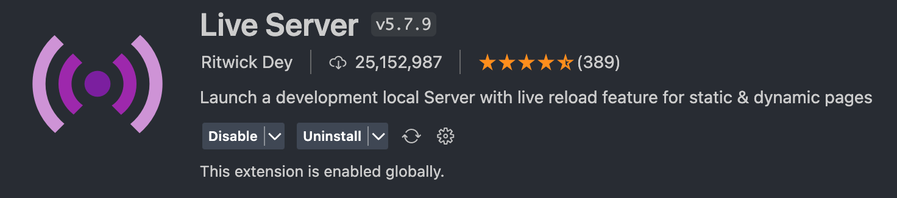

# Horiseon Marketing Agency
---

## Description

This project was built on the idea that this website would be viewed by the customers of a marketing agency. Thus, the webpage must meet accessibility standards. The starter code was sourced [elsewhere](#credits) and this project then refined the HTML and CSS code for long-term sustainability. This project solved a variety of semantic HTML issues, unnecessary uses of css selectors as well as add necessary accessibility features such as alternative text for images. This project allows one to learn the proper use of semantic html elements, the importance of accessibility standards, and overall increase the efficiency and durability of an existing codebase.

## Table of Contents

- [Installation](#installation)
- [Usage](#usage)
- [Credits](#credits)

## Installation

Below is an example of how you can download the project onto your own device:

1. Open your devices terminal application
2. Locate to the correct file destination that you are wanting to download this project to
3. Clone the repository using this link:
    ```md
        git clone https://github.com/squrpe/bootcamp-week1challenge.git
    ```
4. You may get prompted to input you github details, thus do so. Otherwise, the project will now be succesfully installed onto your device.

## Usage

To access this project, you can download an IDE of your choice but we recommend Visual Studio Code.

After downloading the IDE of your choice you will have access to the raw code. However to host the webpage locally, you will need to download an extension that allows you to open it into your default browser or in your IDE. I recommend Liveserver:



Then using this type of extension, right clicking the file and pressing "Open with Live Server" allows you to open the webpage in your default browser.


## Credits

Source code: [The University of Adelaide's Full Stack bootcamp](https://adelaide.bootcampcontent.com/the-university-of-adelaide/UADEL-VIRT-FSF-PT-08-2022-U-LOLC)

---

## Features

- Alternative Text for images
- Language: English

## Contact

Lara Grocke - [@my_twitter](twitter.com) - [myemail@email.com](gmail.com)

Project Link - https://github.com/squrpe/bootcamp-week1challenge